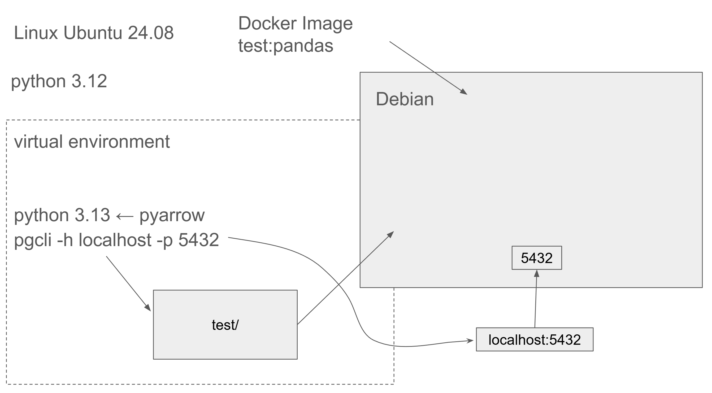

Docker lets you run an application together with everything it needs (libraries, system tools, runtime) without installing those things on your main system.

The simpliest run command: docker run hello-world 
Quit commands: Ctrl + D; exit()

```
-it (You can interactively type commands into the container. You get a terminal-like shell inside the container.)
--rm (Automatically remove the container when it exits) 
--entrypoint=bash or bash (Ignore the image’s default entrypoint and start bash instead)
-v means mount a volume — it connects a directory or file on your host system to a path inside the container.
-v $(pwd)/test:/app/test, where pwd - expands to the absolute path of your current directory
```

Question 1. Understanding Docker images
Run docker with the python:3.13 image. Use an entrypoint bash to interact with the container.
What's the version of pip in the image?
```
docker run -it \
    --rm \
    --entrypoint=bash \
    python:3.13-slimpython3

pip -V # pip 25.3 from /usr/local/lib/python3.13/site-packages/pip (python 3.13)

docker build -t test:pandas .
```

### Simple Dockerfile with pip
```
# base Docker image that we will build on
FROM python:3.13.11-slim

# set up our image by installing prerequisites; pandas in this case
RUN pip install pandas pyarrow

# set up the working directory inside the container
WORKDIR /app
# copy the script to the container. 1st name is source file, 2nd is destination
COPY pipeline.py pipeline.py

# define what to do first when the container runs
# in this example, we will just run the script
ENTRYPOINT ["python", "pipeline.py"]
```
### Dockerfile with uv
```
# Start with slim Python 3.13 image
FROM python:3.13.10-slim

# Copy uv binary from official uv image (multi-stage build pattern)
COPY --from=ghcr.io/astral-sh/uv:latest /uv /bin/

# Set working directory
WORKDIR /app

# Add virtual environment to PATH so we can use installed packages
ENV PATH="/app/.venv/bin:$PATH"

# Copy dependency files first (better layer caching)
COPY "pyproject.toml" "uv.lock" ".python-version" ./
# Install dependencies from lock file (ensures reproducible builds)
RUN uv sync --locked

# Copy application code
COPY pipeline.py pipeline.py

# Set entry point
ENTRYPOINT ["uv", "run", "python", "pipeline.py"]
```

#### Explanation:

- FROM: Base image (Python 3.13)
- RUN: Execute commands during build
- WORKDIR: Set working directory
- COPY: Copy files into the image
- ENTRYPOINT: Default command to run


```
docker build -t test:pandas .                    # build the image:

docker run -it test:pandas some_number           # run the container and pass an argument to it, so that our pipeline will receive it:
```


### Running PostgreSQL in a Container
```
docker run -it --rm \
  -e POSTGRES_USER="root" \
  -e POSTGRES_PASSWORD="root" \
  -e POSTGRES_DB="ny_taxi" \
  -v ny_taxi_postgres_data:/var/lib/postgresql \
  -p 5432:5432 \
  postgres:18
```
- -e sets environment variables (user, password, database name)
- -v ny_taxi_postgres_data:/var/lib/postgresql creates a named volume
- Docker manages this volume automatically
- Data persists even after container is removed
- Volume is stored in Docker's internal storage
- -p 5432:5432 maps port 5432 from container to host
- postgres:18 uses PostgreSQL version 18 (latest as of Dec 2025)


### Connecting to postgress
```
uv add --dev pgcli
uv run pgcli -h localhost -p 5432 -u root -d ny_taxi
```
- uv run executes a command in the context of the virtual environment
- -h is the host. Since we're running locally we can use localhost.
- -p is the port.
- -u is the username.
- -d is the database name.
- The password is not provided; it will be requested after running the command.